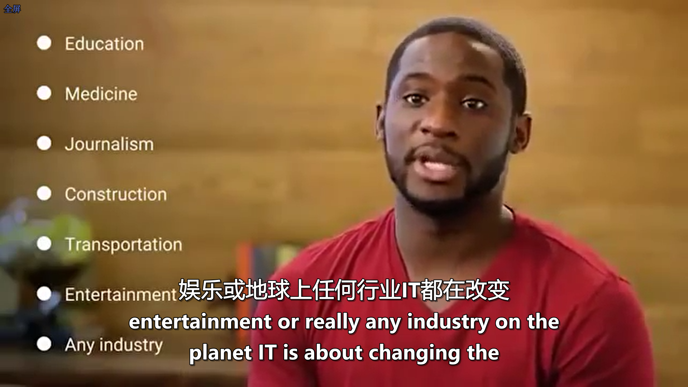
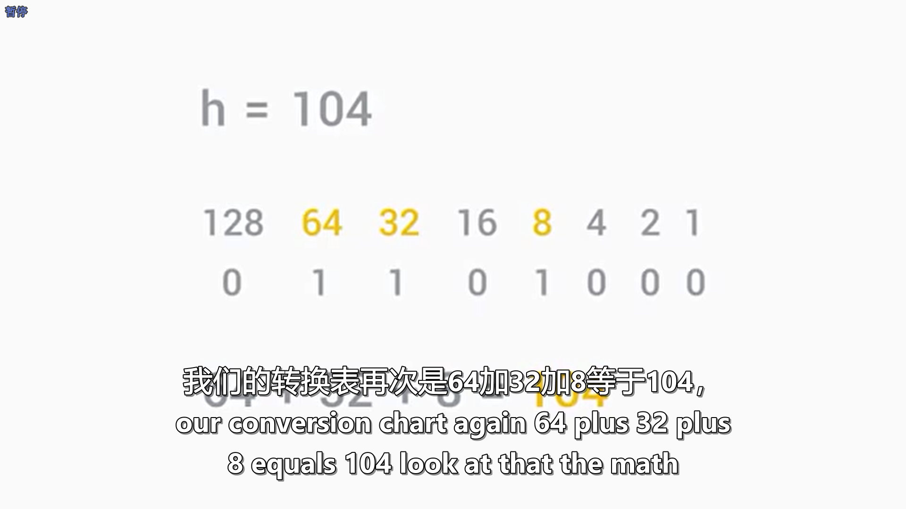
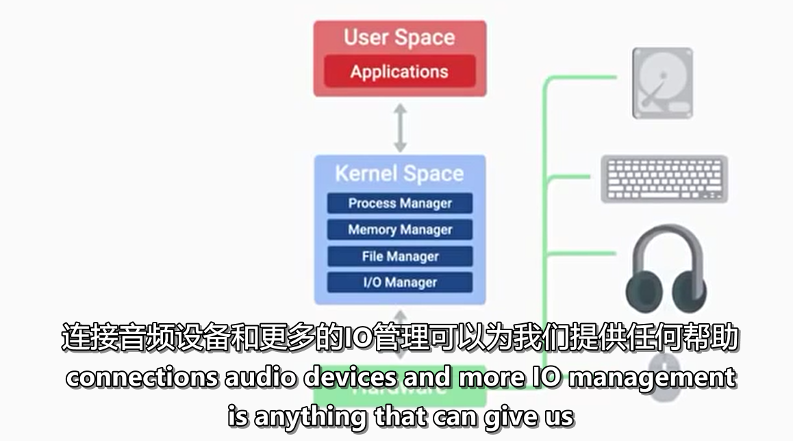
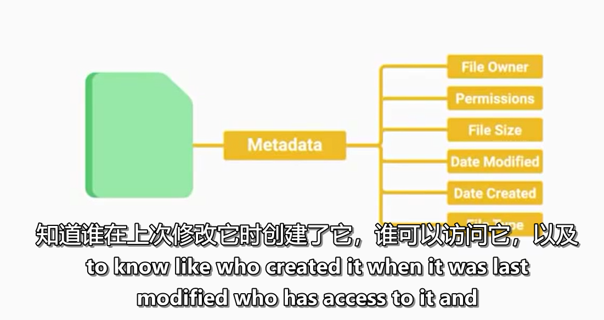

#### 41911025 纪晓泽

# **IT Support Professional Certificate**
## **Technical Support Fundamentals**

## intro to IT

### 1.Introduction
> what is information technology?
>> The use of digital technology, like computers and the Internet, to store and process data into useful information.

> IT is changing any industry in the planet

> What does an IT Support Specialist do?
>> Managing Installing Maintaining Troubleshooting Configuring

### 2.History of Computing

> From Abacus to Analytical energine

> Algorithm: a series of steps that solve specific problems

> The path to modern computers

### 3.Digital Logic

> Computer Language
>> Binary system: The communication that a computer uses, also known as a base-2 numeral system

> Character encoding
>> assigns our binary values to characters, so that we as humans can read them

> Binary
>> Logic gates: allow our transistors to do more complex tasks, like decide where to send electrical signals depending on logical conditions

> How to count in binary
>> 

### 4.Computer Architecture Layer

> Abstraction
>> to take a relatively complex system and simplify it for our use

> Computer architecture overview
>> computers can be cut into four main layers: **hardware**(make up of physical components of a cpmputer), **operating system**(allows hardware to communicate with the system), **software**(how we as humans interact with our computer)and **users**                 

## Hardware

### 1. The modern computer

> Intro to computer hardware
>> ports: connection points that we can connect devices to that extend the functionality of our computer

>> **CPU(central Processing Unit)**: the brain of our computer, it does all the calculations and data processing;
**RAM(Random Access Memory)**: our computer's short-term memory;
**Hard drive**: holds all of our data, which includes all of our music, pictures, applications;
**Motherboard**: the body or the circulatory system of the computer that connects all the pieces together

> Program and hardware
>> programs: instructions that tell the computer what to do;  MCC is a bridge between CPU and RAM

> Module Introduction

### 2. Components

> CPU、RAM

> storage

> power supplies

> peripherals: anything that you connect with your computer externally that adds functionality

## Operating System

### 1. What's an operating system

> Components of an operating system
>> operating system: the whole package that manages our computer's resources and lets us interact with them

> Files and file system
>> File handling: data, metadata, file system

> Process management
>> process: a program that's executing, like our internet browser or text editor

> memory management

> I/O management

> Interact with the OS: user space

> Logs

> The boot process

### 2. Installing an operating system

> Choosing an operating system

> Virtual machines

> Installing Windows/Linux/Mac OS X

## Networking

### 1.What is networking

> basics of networking
>> computers on a network have an identifier called an IP address

> networking hardware

> language of the Internet
>> networking protocols: routed efficiently, aren't corrupted, secure, right machine, named appropriately

> the web

### 2.Limitations of the Internet

> history of the Internet

> Limitations of the Internet

### 3.Impact of Internet

> impact

> Internet with things

> privacy and security

## Software

## 1.Intro to software

> what is software

> types of software
>> application software, system software, firmware,

> recipe for computing

### 2.Interacting with Software

> managing software

> installing, updating, and removing software from windows

> software automation

## Troubleshooting

### 1. Troubleshooting Best Practices

> module introduction

> ask questions!

> isolating the problem

> follow the Cookie crumbs

> start with the quickest step first

> troubleshooting pitfalls to avoid

## 2.customer service

> intro to soft skills

> anatomy of an interaction

> how to deal with difficult situations

### 3.Documentation
